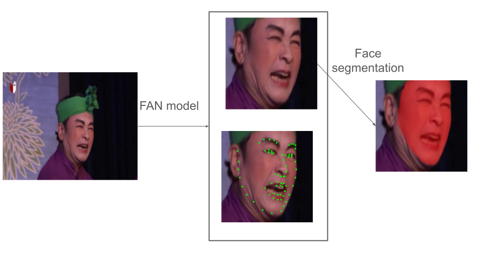

# deca_dataset_builder: Build Datasets for Training DECA

This repository helps you **prepare datasets for training [DECA](https://github.com/YadiraF/DECA) (SIGGRAPH 2021)**.  

> If you are looking for the original DECA implementation, check the [official DECA repository](https://github.com/YadiraF/DECA).

---

## Key Features
This tool extends DECA’s functionality to automate dataset preparation:

- Convert **folders of videos** into **folders of images**.  
- Detect **68 facial landmarks** on each image using [FAN](https://github.com/1adrianb/2D-and-3D-face-alignment).  
- Crop faces and save aligned images.  
- Generate **skin masks** using [face_segmentation](https://github.com/YuvalNirkin/face_segmentation).  

---
## Workflow
- Here is a visual overview of the dataset preparation workflow:

---

## Getting Started

### 1. Clone the repository
```bash
git clone https://github.com/HoangViet252006/deca_dataset_builder.git
cd deca_dataset_builder
```
## 2. Install required data

Download one of the pretrained face segmentation models:

- [face_seg_fcn8s.zip](https://github.com/YuvalNirkin/face_segmentation/releases/download/1.0/face_seg_fcn8s.zip)
- [face_seg_fcn8s_300_no_aug.zip](https://github.com/YuvalNirkin/face_segmentation/releases/download/1.1/face_seg_fcn8s_300_no_aug.zip)

Extract the contents into the `data` folder of the repository.

---

## Usage

### Convert videos to images
```bash
python -m utils.dataset_processing.py
```
### Build dataset for DECA training
```bash
python build_dataset.py
```
--- 
## Recommended Data Structure
- Please make sure your folder is in the location as shown below
```
├── data
├── your list video
| ├── video_1.mp4
| ├── video_2.mp4
| └── video_3.mp4
├── build_datasets.py
└── FAN.py
```